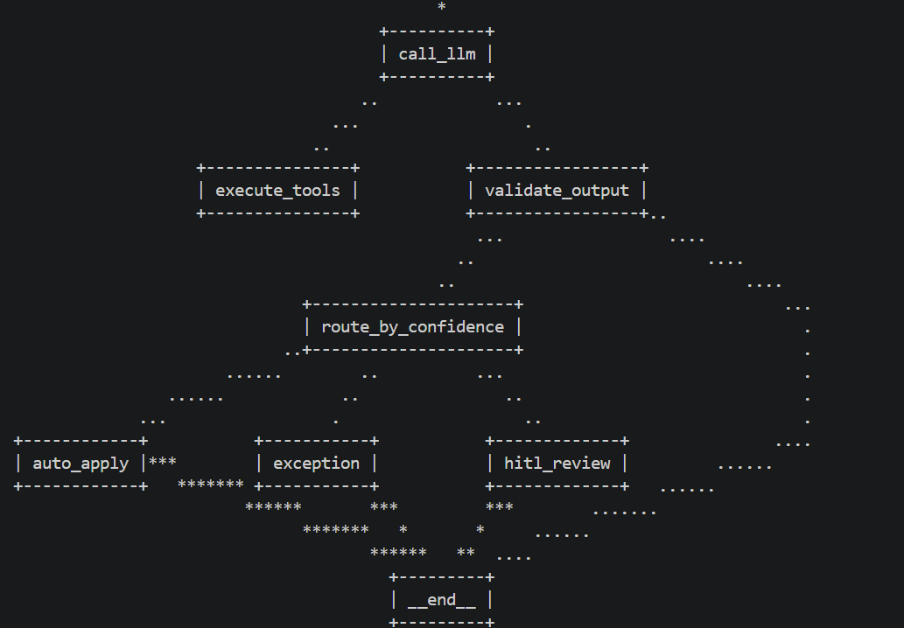

# I2C Cash Application Agent — Week 2 (LangGraph)

LangGraph rewrite of the [Week 1 hand-rolled agent](https://github.com/ravikumargurumurthy/i2c-agent-week1) with two meaningful upgrades:

1. **Confidence-based routing** — the agent now decides what to *do* with each extraction (auto-apply, route to HITL queue, or escalate as exception), not just *return* a value
2. **Structured observability** — every node execution emits a JSON record to a per-run trace file, building the audit trail finance-grade systems require

Same domain (I2C remittance extraction), same eval suite (13/13 passing including 3 routing-specific cases), explicit state machine instead of a hand-rolled loop.

**Status:** Week 2 of 12. Builds on Week 1's foundations.

---

## What this is

The cash application step in invoice-to-cash is labor-intensive: AR analysts read remittance text from emails, PDFs, and EDI files, then figure out which payments cover which invoices, what's been short-paid, and what deductions are being claimed. Misallocations cost real money — wrong customer credited, dispute aged out, write-offs that shouldn't have happened.

This agent automates the extraction step **and the workflow decision after it**. Takes unstructured text, calls three deterministic tools (regex parsing, fuzzy customer lookup, open-AR verification), produces a validated `RemittanceAdvice`, then routes to one of three downstream actions based on confidence:

- **Auto-apply** (≥0.95): writes a mock ledger entry; would post to GL in production
- **HITL review** (0.70–0.94): enqueues for analyst review
- **Exception** (<0.70): escalates for ops investigation

Every run produces a structured trace file recording every node execution — the foundation of audit trails real cash app systems need.

This is deliberately **not a chatbot**. It's a stateful workflow designed for finance ops, where accuracy beats fluency, schema validation is non-negotiable, and uncertain cases route to humans instead of auto-executing.

---

## Architecture

The agent is a LangGraph state machine:

\`\`\`
                    START
                      │
                      ▼
                  call_llm  ◀──────────────┐
                      │                    │
              ┌───────┴───────┐             │
              ▼               ▼             │
        execute_tools  validate_output      │
              │               │             │
              └───────────────┤             │
                              │             │
                  ┌───────────┴──┐          │
                valid           invalid     │
                  │               │         │
                  ▼               └─────────┘
              route_by_confidence
                  │
        ┌─────────┼─────────┐
        ▼         ▼         ▼
   auto_apply  hitl_review  exception
        │         │         │
        ▼         ▼         ▼
       END       END       END
\`\`\`

Seven nodes, four conditional edges, three terminal exits. State flows through as a typed Pydantic model with reducers (`Annotated[list, add]`) for cumulative fields.

The LLM is just one node in this graph. Schemas, validation, retry logic, and routing are explicit in the topology rather than buried in a function body.

---

## Quick start

\`\`\`bash
git clone https://github.com/ravikumargurumurthy/i2c-agent-week2.git
cd i2c-agent-week2
python3 -m venv .venv
source .venv/bin/activate
pip install -r requirements.txt
\`\`\`

Create `.env` with Azure credentials (or adapt for OpenAI direct):

\`\`\`
AZURE_OPENAI_ENDPOINT=https://your-tenant.openai.azure.com/
AZURE_OPENAI_API_KEY=...
AZURE_OPENAI_API_VERSION=2024-12-01-preview
AZURE_OPENAI_DEPLOYMENT=your-deployment-name
\`\`\`

Run the demo:

\`\`\`bash
python agent.py    # exercises all three routing branches
\`\`\`

Run the eval suite:

\`\`\`bash
pytest test_agent.py -v    # 13 cases, ~120 seconds
\`\`\`

---

## Eval results — 13/13 passing

| # | Scenario | Tests |
|---|---|---|
| ev_001 | Clean: 1 customer, 1 invoice, exact amount | Baseline extraction |
| ev_002 | Clean: 1 customer, 2 invoices | Multi-allocation |
| ev_003 | Short-pay with explicit reason | Deduction enum + reason capture |
| ev_004 | Short-pay with no reason given | Default to `unknown` reason |
| ev_005 | Customer matched via alias, not legal name | Alias resolution |
| ev_006 | Ambiguous payer name (`"Acme"` matches two customers) | Refuses to resolve |
| ev_007 | Invoice not in open AR | Allocates with low-confidence flag |
| ev_008 | Total > sum of allocations | Unallocated remainder |
| ev_009 | Customer overpayment | Reverse direction of same rule |
| ev_010 | Unknown payer (`"Random Corp"`) | Returns null, refuses match |
| ev_R001 | Clean two-invoice payment | Routes to auto_apply |
| ev_R002 | Clean short-pay | Routes to auto_apply per rubric |
| ev_R003 | Unknown payer | Routes to exception |

**Same eval suite as Week 1**, with 3 routing-specific cases added. The Week 1 → Week 2 framework migration preserved 10/10 of the original cases — concrete evidence the refactor maintained behavior.

Confidence assertions use bands (`min_confidence ≤ actual ≤ max_confidence`) rather than equality, accommodating LLM non-determinism while still constraining the agent's policy.

---

## Sample run trace

A real trace from one of the demo runs. Every node execution recorded with timing:

\`\`\`
▶ Run started: <run_id>

  → call_llm             input: {'messages_count': 0, 'validation_retries': 0, ...}
  ✓ call_llm           1247.3ms  output: {'messages': '+3 message(s)', 'validation_error': None}
  → execute_tools        input: {'messages_count': 3, ...}
  ✓ execute_tools        12.4ms  output: {'messages': '+1 message(s)'}
  → call_llm             input: {'messages_count': 4, ...}
  ✓ call_llm            943.1ms  output: {'messages': '+1 message(s)', 'validation_error': None}
  → execute_tools        input: {'messages_count': 5, ...}
  ✓ execute_tools        18.7ms  output: {'messages': '+1 message(s)'}
  → call_llm             input: {'messages_count': 6, ...}
  ✓ call_llm           1102.4ms  output: {'messages': '+1 message(s)', 'validation_error': None}
  → execute_tools        input: {'messages_count': 7, ...}
  ✓ execute_tools         8.2ms  output: {'messages': '+1 message(s)'}
  → call_llm             input: {'messages_count': 8, ...}
  ✓ call_llm            876.5ms  output: {'messages': '+1 message(s)', 'validation_error': None}
  → validate_output      input: {'messages_count': 9, ...}
  ✓ validate_output       3.1ms  output: {'advice': 'set'}
  → route_by_confidence  input: {'has_advice': True, ...}
  ✓ route_by_confidence   0.8ms  output: {'routing_decision': 'RoutingDecision.AUTO_APPLY'}
  → auto_apply           input: {'has_advice': True, 'routing_decision': 'RoutingDecision.AUTO_APPLY'}
  ✓ auto_apply           1.4ms  output: {'action_result': 'auto_apply'}

■ Run ended: ok
    confidence: 0.97
    routing_decision: RoutingDecision.AUTO_APPLY
\`\`\`

Full JSONL traces are written to `traces/{run_id}.jsonl`. See `docs/sample_trace_auto_apply.txt` for the complete record.

---

## Design decisions worth highlighting

**State machine over function loop.** The agent is expressed as nodes and edges, not as a `for` loop with `if/else`. This means routing logic lives in the graph topology where it's inspectable, not buried inside function bodies. The graph diagram above is the documentation; reading the LangGraph wiring is reading the agent's behavior.

**Decision and dispatch are separated.** `route_by_confidence_node` records *what was decided* in state. `route_to_terminal` (an edge function) reads the decision and dispatches to the corresponding terminal. This separation means the routing decision is part of the audit trail — you can answer "why was this auto-applied?" by inspecting state, independent of where execution actually went.

**Errors are data, not exceptions.** Tool failures (unknown tools, exceptions in tool code) become structured error strings the LLM reads on the next iteration and reasons about. The agent loop never crashes on a tool error — it self-corrects or gracefully lowers confidence. The same principle holds for validation: schema or business-rule failures trigger a single repair retry with the error fed back as user feedback.

**Confidence bands drive routing, not autonomy.** The agent doesn't decide whether to apply payments unilaterally. It produces a multi-signal confidence score and the workflow uses that score to dispatch — auto-apply only if ≥0.95, HITL otherwise. Production-realistic posture for finance-grade automation.

**Structured tracing from day one.** Every node execution emits a JSON record to a per-run trace file. The pattern (append-only structured records keyed by run_id) maps directly to a Postgres audit table when this graduates from local prototype to multi-tenant production.

**Stable interface enabled refactor.** Week 1 was a hand-rolled loop; Week 2 is a LangGraph state machine. The `extract_remittance(text) -> dict` signature stayed stable, which is why the same eval suite ran against both implementations with no test changes (other than adapting to the new return shape with routing fields). Interface stability is what makes refactoring possible without behavioral regression.

---

## What this should NOT be used for

- **Production cash application.** Synthetic data, single-currency, no real ERP integration. This is a learning project, not a deployable system.
- **Auto-applying payments at any volume without observation.** The eval suite is 13 cases. Real production would need 100+ labeled cases plus 4+ weeks of shadow-mode validation against an existing manual process before any auto-execute decisions.
- **Bank-statement-driven cash app.** Real cash app starts with bank payments and matches them to remittances. This agent only handles the remittance-extraction half of that flow. Bank statement importing and payment-to-remittance matching are on the Week 3+ roadmap.
- **Multi-currency or multi-entity remittances.** USD-only; no FX, no intercompany handling.
- **PDF, Excel, or EDI input.** Text input only. Multi-format extraction is the Week 3 task.
- **Audit-grade traceability beyond the local file system.** Tracing writes JSONL to disk; production would need an immutable append-only Postgres table with proper RBAC and retention policies.
- **Trusting `extraction_notes` as an audit log.** It's a useful reasoning trace generated by the model. It is not a substitute for structured audit records.

---

## What changed from Week 1

| Concern | Week 1 | Week 2 |
|---|---|---|
| Framework | Hand-rolled loop with `for`/`continue` | LangGraph state machine |
| State | Local function variables | Pydantic `AgentState` with reducers |
| Control flow | `if/else` inside a loop body | Conditional edges between named nodes |
| Routing | None — caller decides | Confidence-based routing baked into the workflow |
| Audit trail | `verbose=True` to stdout | Structured JSONL traces per run |
| Eval cases | 10 (extraction only) | 13 (extraction + routing) |
| Lines of code | ~150 | ~300 |
| Inspectability | Read 70 lines of loop | Read graph topology + 7 nodes |

The lines-of-code increase reflects added capability, not added complexity. Each node is small and single-purpose; reading them in isolation is much cleaner than tracing through Week 1's loop.

---

## Engineering log

`FINDINGS.md` documents the day-by-day build, including:

- A 4-iteration debug log of a single threshold-tuning bug from Week 1
- Three iterations of the same eval-design mistake (expecting confidence outside what the system prompt rubric allows), and the systematic discipline that closes it
- The discovery that Azure GPT-5.3 doesn't support `temperature` overrides
- The rationale behind file-based custom logging vs. LangSmith
- The Week 2 retrospective covering what state machines actually buy you over loop control

That triage discipline log is more valuable than the agent itself.

---

## Repository structure

\`\`\`
i2c-agent-week2/
├── agent.py              # LangGraph state machine with 7 nodes, 4 conditional edges
├── tracing.py            # Structured logging layer with @trace_node decorator
├── inspect_trace.py      # CLI for human-readable trace inspection
├── schemas.py            # RemittanceAdvice + InvoiceAllocation Pydantic models (unchanged from Week 1)
├── tools.py              # parse, lookup_customer, lookup_open_invoices (unchanged from Week 1)
├── eval_data.py          # 13 hand-labeled cases (10 extraction + 3 routing)
├── test_agent.py         # pytest harness (parametrized, set-based comparison, confidence bands)
├── data/
│   ├── customers.json    # synthetic 15-customer master
│   └── open_invoices.json # synthetic 30-invoice open AR
├── docs/
│   ├── sample_trace_auto_apply.txt    # human-readable trace
│   └── eval_output.txt   # full pytest output
├── traces/               # per-run JSONL traces (gitignored)
├── FINDINGS.md           # engineering decisions and debugging notes
├── requirements.txt
└── README.md

